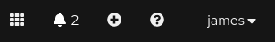

# Compliance Operator Exploration - OpenShift Console

## Prerequisites

- A connected OpenShift 4.7 cluster installed and reachable
  - This could be a disconnected cluster but you would have to pre-mirror some content for the purposes of this exploration
  - This cannot be a CodeReady Containers cluster as part of what we're doing is rolling out updated `MachineConfigs`, which doesn't work on CRC.
- A logged in `User` with the `cluster-admin` `ClusterRole` applied.
  - You can check this by navigating to the following sections while logged in to the console:
    - Ensure you're in Administrator view in the pulldown in the top left
    - Click on User Management
    - Click on RoleBindings
    - In the search bar, type "cluster-admin"
    - Look for a `ClusterRoleBinding` that binds the `ClusterRole` named `cluster-admin` to either the `User` you're logged in as, or a `Group` of which your user is a member.
    - Honestly, if you can see these bindings, you're a `cluster-admin`.

## Installation

You can install the operator in the OpenShift Console web UI by navigating the menus as follows:

- Ensure you're in Administrator view in the pulldown in the top left
- Click on Operators
  - Click on OperatorHub
    - Search for 'compliance' and use the filters on the left side to set the Provider type to "Red Hat."
    - Click on the Compliance Operator
    - Click "Install"
    - Accept the defaults - that is, the 4.7 channel, a specific namespace, and the operator-recommended namespace with an Automatic approval strategy. Optionally, check the box to enable monitoring on the namespace. Select "Install" to proceed.
    - Wait for the installation to finish and report success in the UI.

The operator is now successfully installed.

## Exploring the preinstalled content

After operator installation you'll be presented with an option to view the installed operator. Click that button and you'll see the provided APIs. These represent the Kubernetes objects that the Operator understands, tracks, and manipulates in support of your desired action. Some of them are pre-downloaded as part of installation. Along the top there are options to click these different APIs as browsable tabs, instead of clickable cards.


Click on the "All instances" tab to see these preinstalled bits of content.

### Breakdown

The Compliance Operator attempts to consolidate each type of object it might need into a unique Custom Resource Definition (CRD), and some of the resource types are bundles or higher abstractions that encapsulate some of the lower resource objects.

You can envision why this would be helpful, for example, if you consider the case of the login banner as an example. Many different compliance profiles (CIS benchmarks for commercial, PCI DSS for financial, HIPAA for healthcare, and of course the NIST controls for federal agencies) might require a setting on the login banner. The values between those profiles differ, but the way to set the banner will be the same for all of them.

To follow Don't Repeat Yourself (DRY) principles, the Compliance Operator breaks down these things into similar chunks that the underlying tooling has already done. That is, XCCDF profiles already have profiles, rules, and tunables. The major change here is that content and execution must be similarly tracked via CRD, and for that reason we have Scans, Suites, Bindings to tie these configuration objects together with a runtime component, Results for the output of a Scan or Suite, and Remediations to request and track what we'll do about failed Results. The CRD types for each of these are named more explicitly and you can browse the pre-installed content.

### ProfileBundles

The primary object that gets distributed with the Compliance Operator are `ProfileBundles`. In the tab listing of objects, change from "All instances" to `ProfileBundle`. You may have to scroll the horizontal bar to the right. You should see two instances of `ProfileBundles` preinstalled.

#### ocp4

This `ProfileBundle` concerns the Kubernetes platform and components that live inside the Kubernetes API natively. Click on the `ocp4` link in the list and you'll be brought to the details of this `ProfileBundle`. The primary thing you'll see on the Details page is the list of Conditions, and you should see a Type of Ready with a Status of True. This indicates that the `ProfileBundle` was downloaded, unpacked, and parsed by the operator to generate the `Profiles` for the platform for various compliance standards. If you click on the sub-tab for `YAML` you can see the raw definition of the instance. Pay special attention to the `spec` section where it indicates which file should be parsed, and which image contains that content file. That image is referenced by manifest hash, and the hash associated is associated with a specific release of the bundles that was packaged with a specific release of the Compliance Operator.

#### rhocs4

This `ProfileBundle` concerns the operating system that underlies the Kubernetes platform in OpenShift. You can browse the details of that `ProfileBundle` by using your browser's back button twice to return to the listing and clicking on it. It's derived from the same bundle content image, but the profile is built from a different file in that image. This means one image contains all of the content for the platform and the operating system.

#### Then why are they split up?

If the same container image contains the ocp4 and rhocs4 content files, then you may wonder why they're split. The answer comes down to the best practice of least privilege. Executing scans on certain portions of the operating system, and almost all remediations, will require privileged host access. Any changes in the Kubernetes API itself need only privileged API access, but can be accomplished with no privilege on the host. For this reason, the design has split them up from the beginning. The content is still distributed in a single image, because the OpenShift Container Platform includes the Red Hat CoreOS operating system, the Kubernetes API, and the platform services delivered on top of it by operators. They're all versioned and tracked together to ensure maximum benefit from the integrations, but they're still separate pieces that need different treatment in this context.

### Profiles

The bundles themselves are not terrifically useful for us. The real advantages come from the profiles we extract from those bundles. Let's look at the available profiles. Use your browser's back button until you're at the listing of `ProfileBundle` instances again, but then use that horizontal scrolling section at the top to look at `Profile` resources.

#### Out of the box

Out of the box profiles included as of Compliance Operator release 0.1.29 are the Center for Internet Security (CIS) benchmarks commonly used for commercial systems, the Essential Eight (E8) benchmarks for the Australian government, and the FISMA moderate systems requirements from NIST SP 800-53.

#### Extending the out-of-the-box

First off, the [Compliance As Code (CaC) project on GitHub](https://github.com/ComplianceAsCode/content) houses the upstreams for all of the generated content. If you wanted to generate your own content, you could do so. I would recommend starting from the [Developer Guide](https://github.com/ComplianceAsCode/content/tree/master/docs/manual/developer) to understand how to build compliance content for this framework, and encourage you to contribute your work in collaboration with the upstream.

Included in the CaC repository is an OpenShift [BuildConfig](https://github.com/ComplianceAsCode/content/blob/master/ocp-resources/content-cluster-build.yaml) that enables you to use the native features of OCP to build the compliance bundle images that the `ProfileBundles` reference. You can apply the default BuildConfig (as of the writing of this guide) by following these steps:

- On the navigation bar at the top, click the Plus icon

    

- Make sure that the Project pulldown in the top left, to the right of the left-side navigation bar, is set to `Project: openshift-compliance`.
- Open the following link in a new tab in your browser: [Content BuildConfig](https://raw.githubusercontent.com/ComplianceAsCode/content/master/ocp-resources/content-cluster-build.yaml) (this is in the ComplianceAsCod repository).
- Copy the entirety of the `ImageStream` and `BuildConfig` YAML text, pasting it into the "Import YAML" box in the OpenShift console.

Because this build is directly off of the master branch of the upstream, its stability is not guaranteed and the content is not strictly supported under Red Hat's terms. If you need a supported fix from the upstream backported to your OpenShift deployment, you should be able to open a support ticket to receive a prerelease update through official channels.

For our purposes today, though, we're going to use this master branch to explore some coming changes in a future release of the supported content.

Click on the `Builds` section on the left-side navigation bar, then navigate to the `BuildConfigs` subsection. Click on the `cac-build` `BuildConfig` we just created above, then use the `Actions` pulldown in the top right to select `Start build`. You can click on the `Logs` tab of the new `cac-build-1` `Build` to watch the progress.

When the build is finished, you should be able to see a Tag listed in the `ImageStream`. On the left-side navigation bar, still in the `Builds` section, navigate to the `ImateStreams` subsection. Click on the `cac-build` `ImageStream` and scroll to the bottom, to the `Tags` section of the page. You should see `cac-build:latest` as one of the tags, showing `Last updated` very recently (because we just built it).

### Configuring our new ProfileBundles

To point a new `ProfileBundle` object at the freshly built upstream images, we just need to point them to the `cac-build` `ImageStream` that the we looked at above.

In the left-side navigation bar, navigate to the `Operators` section and the `Installed Operators` subsection. Click on the Compliance Operator in the list, then do the following to add the new `ProfileBundles` from our image.

1. Select "Create instance" for the the `ProfileBundle` object card
1. Set the name to `upstream-ocp4`
1. Set the "Content Image" to `cac-build:latest`
1. Click `Create`
1. You can watch as the `Status` column for this `ProfileBundle` cycles through the stages as the Compliance Operator processes it, ending on `Condition:✅ Ready`
1. Click the blue `Create ProfileBundle` button towards the top right to add another bundle
1. Set the name to `upstream-rhcos4`
1. Set the "Content File" to `ssg-rhcos4-ds.xml`
1. Set the "Content Image" to `cac-build:latest`
1. Click `Create`

For this last `ProfileBundle`, let's watch the effects of the Operator unpacking it. Quickly after clicking `Create` there, click on the blue `Compliance Operator` text in the top left, just to the right of the left-side navigation bar. Then, in the horizontal scroll bar near the top that starts with `Details` and `YAML`, scroll to the right and select the `Profile` object. The list after the first `ProfileBundle` but before the second one should have 11 entries (at the time of this writing, at least - this could change based on either the ComplianceAsCode project or updated default `ProfileBundles` from the operator) and you can watch more popping in as the operator parses the `upstream-rhcos4` `ProfileBundle`.

There are more profiles in the upstream than in the supported downstream - because this is changing all of the time. It may make sense to look at upstream content at some point, or you could do like we mentioned earlier and work with support.

### Looking into a profile

Let's see what's in our new RHCOS4 STIG profile, while we're here at the `Profiles` listing for the operator. Click on the `upstream-rhcos4-stig` `Profile`, then click on the `YAML` tab to see all of the information we know about this `Profile`. At the top of the definition is a `description` key. It's formatted a bit strangely here as it expects to be rendered HTML, not text in a YAML file, but you should be able to read it.

### ProfileBundles - more than Profiles

Scrolling down further, there is a list under the `rules` key. These `rules` are prepended with our `ProfileBundle` name - because every bundle unpacks its own rules - but what follows are the actual STIG ID name portions for each of these rules. This makes cross-referencing what's in a `Profile` to what you would expect it to do pretty easy!

The operator parses the datastream xml files in the bundles and unpacks a lot more than just the profiles from them. Profiles are a collection of rules, and those rules are all bundled into the compiled datastream as well.

Click the blue `compliance-operator.v.0.1.3.2` (or whatever version) link up in the top left, to the right of the left-side navigation bar, then change from the `Profile` resource list to the `Rule` resource list (you'll probably have to scroll further right in that horizontal scroll bar).

In the search bar under the big word `Rules`, type `upstream-` and once it finishes resolving to just the rules we've just added scroll for a little bit. There's a lot here, obviously. The operator is able to keep track of all of these rules, and the remediations for them if out of compliance, alongside building them all together into the profiles based on the compliance footprint we're looking to achieve.

## Suites - the basic block that ties profiles together

Because of the privilege split for runtime between the base operating system and the Kubernetes API, but the bundled versioning of content for them, it makes sense to run these scans at the same time but in different ways.

The low level object that enables us to connect a collection of datastreams and a collection of targets is a `ComplianceSuite`. Let's specify a `ComplianceSuite` right now.

1. Scroll all the way back to the top and in that horizontally scrolling section, choose `ComplianceSuite`
1. Click on the blue `Create ComplianceSuite` button on the right side.
1. Set the name to `stig-compliancesuite`
1. Click on the `Scans` section to open a subordinate field list for a new `Scan` entry
    1. Change the "Content Image" to `cac-build:latest`
    1. Change the "Profile" to `xccdf_org.ssgproject.content_profile_stig`
    1. Change the "Name" to `node-stig`
    1. Click on the `Raw Result Storage` section to open a subordinate field list for a new entry
        1. Click on the `Pv Access Modes` section to expand that section
            1. In `Value`, paste `ReadWriteOnce`
        1. Leave anything not mentioned blank
    1. Change "Scan Type" to `Node`
1. Immediately following the `Scan Tolerations` section is a new `Scan` entry - we're going to edit that now:
    1. Change the "Content Image" to `cac-build:latest`
    1. Click on the `Raw Result Storage` section to open a subordinate field list for a new entry
        1. Click on the `Pv Access Modes` section to expand that section
            1. In `Value`, paste `ReadWriteOnce`
        1. Leave anything not mentioned blank
    1. Change "Scan Type" to `Platform`
1. Scroll to the bottom and click `Create`.

You can watch the `Status` column for our `ComplianceSuite` changing as the Compliance Operator processes and executes our specified Suite. One of the phases you'll see on the `ComplianceSuite` is `AGGREGATING`. Because the Compliance Operator is able to work with every node at once, and run many scans on different parts of a system at once, the aggregation phase is used to collect all of the various scan results into buckets based on how we specified the scans.

Wait for `Phase: DONE` to show up for our `ComplianceSuite` and we can go take a look at what comes up!

## Results

We can look at the results of every individual scan that we performed as part of our `ComplianceSuite`. In the horizontal bar at the top, select the `ComplianceCheckResult` resource type. Notice that these many results have a lot of entries in the `Labels` column. These Kubernetes objects have been enriched with lots of metadata, and this will assist us with filtering them to only look at specific things.

1. In the search bar towards the top left of the listing, change the pulldown from `Name` to `Label`.
1. In the search box, paste `compliance.openshift.io/scan-name=platform-scan` and click the popup bubble.
1. Notice that the list of results doesn't include any scans that start with the name `node-stig-` and instead now only show `platform-scan-` results. These are results of scans against the Kubernetes API, rather than the node filesystems.
1. In the `Label` search box, add another label filter by pasting `compliance.openshift.io/check-status=FAIL` and clicking the popup bubble.
1. Notice that the list of results is now shorter, as we've filtered out all of our passing scans and are only looking at failures now.
1. In the `Label` search box, add another label filter by pasting `compliance.openshift.io/check-severity=high` and clicking the popup bubble.
1. In my case at least - I now see no results. There are zero high-severity failures for the NIST moderate scan against the Kubernetes API in a default cluster installation. That's pretty good!
1. Click the `X` next to the right-most label filter (which should be the severity filter) to get back to where we can see some results.
1. Scroll down to the `ComplianceCheckResult` named `platform-scan-classification-banner` and click on the blue name. Navigate to the `YAML` tab and read the description. There is a rule looking for a Classification banner on the OpenShift Console, which is controlled entirely via the Kubernetes API. We don't have one enabled right now, so remediating this result would add a Classification banner.
1. Scroll further down in the YAML to see the labels applied to this `ComplianceCheckResult` and note the various labels provided for us to use for filtering.

This is _incredibly_ powerful. Remember that things we can see in the OpenShift console are not things locked up in a proprietary way - these are Kubernetes resources, and anything that knows how to talk to the Kubernetes API can query for these same results. This means it's easy to enrich a dashboard with scan content if it can execute an HTTP query, and even easier if it's something that already knows how to talk to Kubernetes. You can envision, perhaps, a ServiceNow workflow that scrapes your `ComplianceCheckResults` for their status. Maybe a chat-ops system that enables a bot to notify someone in Slack, Teams, or something similar whenever a new result shows a failure.

**But** (there's always a but), your auditors probably don't think this is particularly cool. Your auditors probably think this is obtuse, and want to coninue using the tooling they have been ordained to use for official audits of your compliance.

### Raw results

We set some specific values in our `ComplianceSuite` around `Raw Result Storage`. Let's look at what that did.

1. On the left-side navigation bar, click on the `Storage` section.
1. Open the `PersistentVolumeClaims` subsection.
1. Note the two `PVCs` created here - one each for the `node-stig` and `platform-scan` elements of our `ComplianceSuite`.

These PVCs store the raw XML output of the OpenSCAP scans that the Compliance Operator used to generate all of those cool Kubernetes objects for us. It's totally unmodified and works exactly like running OpenSCAP normally, it just happened inside containers and stored the output here to be harvested by us later. So, let's harvest it. This isn't possible to do through the Console UI, though, so we'll have to drop to a terminal for this one.

1. To install the `oc` command line client on your machine from the console, up in the top right of the console click the question mark from the navbar.

    

1. Click on the `Command line tools` entry.
1. Download the `oc` client for your system by clicking the appropriate link.
1. Unzip or untar the file to somewhere in your `$PATH` (like `~/bin or ~/.local/bin`), or into whatever directory your PowerShell window is going to be open to on Windows.
1. Open a terminal emulator or PowerShell (and navigate to the folder you unpacked `oc.exe` to, if on Windows)
1. For Linux or Mac hosts, run the following shell commands to download the results:

    ```sh
    # Remove any existing results directory
    rm -rf results
    # Make directories for the nodes and platform
    mkdir -p results/{nodes,platform}
    # Create our temporary pod
    oc apply -f https://raw.githubusercontent.com/jharmison-redhat/compliance-operator-learning/main/03-extract.yaml -n openshift-compliance
    # Wait for it to run
    while ! oc get pod pv-extract -n openshift-compliance | grep -qF Running; do
        sleep 5
    done
    # Pull down the raw results directly
    for scan in nodes platform; do
        oc cp pv-extract:/$scan/0/ results/$scan/ -n openshift-compliance
    done
    oc delete pod pv-extract -n openshift-compliance
    ```

1. For Windows hosts, run the following PowerShell commands to download the results:

    ```pwsh

    ```
