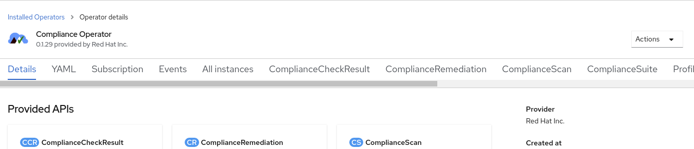

# Compliance Operator Exploration - OpenShift Console

## Prerequisites

- A connected OpenShift 4.7 cluster installed and reachable
  - (This could be a disconnected cluster but you would have to pre-mirror some content for the purposes of this exploration)
- A logged in `User` with the `cluster-admin` `ClusterRole` applied.
  - You can check this by navigating to the following sections while logged in to the console:
    - Ensure you're in Administrator view in the pulldown in the top left
    - Click on User Management
    - Click on RoleBindings
    - In the search bar, type "cluster-admin"
    - Look for a `ClusterRoleBinding` that binds the `ClusterRole` named `cluster-admin` to either the `User` you're logged in as, or a `Group` of which your user is a member.
    - Honestly, if you can see these bindings, you're a `cluster-admin`.

## Installation

You can install the operator in the OpenShift Console web UI by navigating the menus as follows:

- Ensure you're in Administrator view in the pulldown in the top left
- Click on Operators
  - Click on OperatorHub
    - Search for 'compliance' and use the filters on the left side to set the Provider type to "Red Hat."
    - Click on the Compliance Operator
    - Click "Install"
    - Accept the defaults - that is, the 4.7 channel, a specific namespace, and the operator-recommended namespace with an Automatic approval strategy. Optionally, check the box to enable monitoring on the namespace. Select "Install" to proceed.
    - Wait for the installation to finish and report success in the UI.

The operator is now successfully installed.

## Exploring the preinstalled content

After operator installation you'll be presented with an option to view the installed operator. Click that button and you'll see the provided APIs. These represent the Kubernetes objects that the Operator understands, tracks, and manipulates in support of your desired action. Some of them are pre-downloaded as part of installation. Along the top there are options to click these different APIs as browsable tabs, instead of clickable cards.



Click on the "All instances" tab to see these preinstalled bits of content.

### Breakdown

The Compliance Operator attempts to consolidate each type of object it might need into a unique Custom Resource Definition (CRD), and some of the resource types are bundles or higher abstractions that encapsulate some of the lower resource objects.

You can envision why this would be helpful, for example, if you consider the case of the login banner as an example. Many different compliance profiles (CIS benchmarks for commercial, PCI DSS for financial, HIPAA for healthcare, and of course the NIST controls for federal agencies) might require a setting on the login banner. The values between those profiles differ, but the way to set the banner will be the same for all of them.

To follow Don't Repeat Yourself (DRY) principles, the Compliance Operator breaks down these things into similar chunks that the underlying tooling has already done. That is, XCCDF profiles already have profiles, rules, and tunables. The major change here is that content and execution must be similarly tracked via CRD, and for that reason we have Scans, Suites, Bindings to tie these configuration objects together with a runtime component, Results for the output of a Scan or Suite, and Remediations to request and track what we'll do about failed Results. The CRD types for each of these are named more explicitly and you can browse the pre-installed content.

### ProfileBundles

The primary object that gets distributed with the Compliance Operator are `ProfileBundles`. In the tab listing of objects, change from "All instances" to `ProfileBundle`. You may have to scroll the horizontal bar to the right. You should see two instances of `ProfileBundles` preinstalled.

#### ocp4

This `ProfileBundle` concerns the Kubernetes platform and components that live inside the Kubernetes API natively. Click on the `ocp4` link in the list and you'll be brought to the details of this `ProfileBundle`. The primary thing you'll see on the Details page is the list of Conditions, and you should see a Type of Ready with a Status of True. This indicates that the `ProfileBundle` was downloaded, unpacked, and parsed by the operator to generate the `Profiles` for the platform for various compliance standards. If you click on the sub-tab for `YAML` you can see the raw definition of the instance. Pay special attention to the `spec` section where it indicates which file should be parsed, and which image contains that content file. That image is referenced by manifest hash, and the hash associated is associated with a specific release of the bundles that was packaged with a specific release of the Compliance Operator.

#### rhocs4

This `ProfileBundle` concerns the operating system that underlies the Kubernetes platform in OpenShift. You can browse the details of that `ProfileBundle` by using your browser's back button twice to return to the listing and clicking on it. It's derived from the same bundle content image, but the profile is built from a different file in that image. This means one image contains all of the content for the platform and the operating system.

#### Then why are they split up?

If the same container image contains the ocp4 and rhocs4 content files, then you may wonder why they're split. The answer comes down to the best practice of least privilege. Executing scans on certain portions of the operating system, and almost all remediations, will require privileged host access. Any changes in the Kubernetes API itself need only privileged API access, but can be accomplished with no privilege on the host. For this reason, the design has split them up from the beginning. The content is still distributed in a single image, because the OpenShift Container Platform includes the Red Hat CoreOS operating system, the Kubernetes API, and the platform services delivered on top of it by operators. They're all versioned and tracked together to ensure maximum benefit from the integrations, but they're still separate pieces that need different treatment in this context.

### Profiles

The bundles themselves are not terrifically useful for us. The real advantages come from the profiles we extract from those bundles. Let's look at the available profiles. Use your browser's back button until you're at the listing of `ProfileBundle` instances again, but then use that horizontal scrolling section at the top to look at `Profile` resources.

#### Out of the box

Out of the box profiles included as of Compliance Operator release 0.1.29 are the Center for Internet Security (CIS) benchmarks commonly used for commercial systems, the Essential Eight (E8) benchmarks for the Australian government, and the FISMA moderate systems requirements from NIST SP 800-53.

#### Extending the out-of-the-box

First off, the [Compliance As Code (CaC) project on GitHub](https://github.com/ComplianceAsCode/content) houses the upstreams for all of the generated content. If you wanted to generate your own content, you could do so. I would recommend starting from the [Developer Guide](https://github.com/ComplianceAsCode/content/tree/master/docs/manual/developer) to understand how to build compliance content for this framework, and encourage you to contribute your work in collaboration with the upstream.

Included in the CaC repository is an OpenShift [BuildConfig](https://github.com/ComplianceAsCode/content/blob/master/ocp-resources/content-cluster-build.yaml) that enables you to use the native features of OCP to build the compliance bundle images that the `ProfileBundles` reference. You can apply the default BuildConfig (as of the writing of this guide) by following these steps:

- On the navigation bar at the top, click the Plus icon

    

- Paste the following and click create:

    ```sh
    ---
    kind: ImageStream
    apiVersion: image.openshift.io/v1
    metadata:
      name: "cac-build"
    spec:
      lookupPolicy:
        local: true
    ---
    kind: BuildConfig
    apiVersion: build.openshift.io/v1
    metadata:
      name: "cac-build"
    spec:
      runPolicy: "Serial"
      source:
        git:
        uri: https://github.com/ComplianceAsCode/content
        ref: master
      strategy:
        dockerStrategy:
        dockerfilePath: Dockerfiles/ocp4_content
        type: Docker
      output:
        to:
        kind: "ImageStreamTag"
        name: "cac-build:latest"
    ```

Because this build is directly off of the master branch of the upstream, its stability is not guaranteed and the content is not strictly supported under Red Hat's terms. If you need a supported fix from the upstream backported to your OpenShift deployment, you should be able to open a support ticket to receive a prerelease update through official channels.

For our purposes today, though, we're going to use this master branch to explore some coming changes in a future release of the supported content.

Click on the `Builds` section on the left-side navigation bar, then navigate to the `BuildConfigs` subsection. Click on the `cac-build` `BuildConfig` we just created above, then use the `Actions` pulldown in the top right to select `Start build`.
