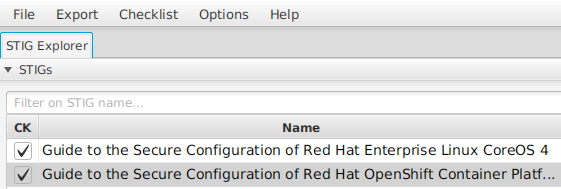
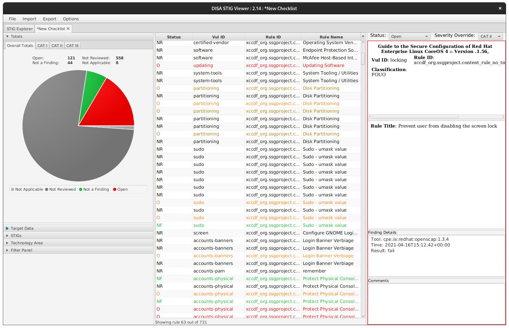

# Compliance Operator Exploration - Command Line Client

## Prerequisites

- A connected OpenShift 4.7 cluster installed and reachable
  - This could be a disconnected cluster but you would have to pre-mirror some content for the purposes of this exploration
  - This cannot be a CodeReady Containers cluster as part of what we're doing is rolling out updated `MachineConfigs`, which doesn't work on CRC.
- A logged in `User` with a `ClusterRoleBinding` for `cluster-admin` applied.
  - You can run the following to check your cluster-bound `ClusterRoles`:

    ```sh
    ./get_roles.sh User $(oc whoami)
    ```

  - Your user also might be a member of a `Group` with this binding, so you can get false negatives with the above command.

## Installation

Included in this repository is a manifest file for subscribing to the operator using the settings listed above. From the command line, run the following:

```sh
oc apply -f 00-subscription.yaml
oc project openshift-compliance
while ! oc get deployment compliance-operator &>/dev/null; do echo -n '.'; sleep 1; done; echo
oc rollout status deployment/compliance-operator
```

The operator is now successfully installed.

## Exploring the preinstalled content

After operator installation finishes, you'll be able to look at the different Custom Resource Definitions (CRDs) it generates. Run the following:

```sh
cac_crds=$(oc get crd | awk '/compliance\.openshift\.io/{print $1}')
echo "$cac_crds"
```

Some of this content gets installed by the operator as it begins to start. You can view the created resources with the following:

```sh
for crd in $cac_crds; do
    echo "** $(echo $crd | cut -d. -f1) **"
    oc get $crd
done | less
```

### Breakdown

The Compliance Operator attempts to consolidate each type of object it might need into a unique Custom Resource Definition (CRD), and some of the resource types are bundles or higher abstractions that encapsulate some of the lower resource objects.

You can envision why this would be helpful, for example, if you consider the case of the login banner as an example. Many different compliance profiles (CIS benchmarks for commercial, PCI DSS for financial, HIPAA for healthcare, and of course the NIST controls for federal agencies) might require a setting on the login banner. The values between those profiles differ, but the way to set the banner will be the same for all of them.

To follow Don't Repeat Yourself (DRY) principles, the Compliance Operator breaks down these things into similar chunks that the underlying tooling has already done. That is, XCCDF profiles already have profiles, rules, and tunables. The major change here is that content and execution must be similarly tracked via CRD, and for that reason we have Scans, Suites, Bindings to tie these configuration objects together with a runtime component, Results for the output of a Scan or Suite, and Remediations to request and track what we'll do about failed Results. The CRD types for each of these are named more explicitly and you can browse the pre-installed content by paging through the output from above.

### ProfileBundles

The primary object that gets distributed with the Compliance Operator are `ProfileBundles`. In the paginated listing of objects, type `/profilebundles` and hit `Enter` to search for that phrase. You may have to return to the top with the `Home` key or press `1G` to goto the first line.

#### ocp4

This `ProfileBundle` concerns the Kubernetes platform and components that live inside the Kubernetes API natively. The value of `VALID` in the `STATUS` column indicates that the `ProfileBundle` was downloaded, unpacked, and parsed by the operator to generate the `Profiles` for the platform for various compliance standards. The other columns list the container image that hosted this bundle and the file that should be referenced in the bundle. That image is referenced by manifest hash, and the hash associated is associated with a specific release of the bundles that was packaged with a specific release of the Compliance Operator.

#### rhocs4

This `ProfileBundle` concerns the operating system that underlies the Kubernetes platform in OpenShift. Note especially that it's derived from the same bundle content image, but the profile is built from a different file in that image. This means one image contains all of the content for the platform and the operating system.

#### Then why are they split up?

If the same container image contains the ocp4 and rhocs4 content files, then you may wonder why they're split. The answer comes down to the best practice of least privilege. Executing scans on certain portions of the operating system, and almost all remediations, will require privileged host access. Any changes in the Kubernetes API itself need only privileged API access, but can be accomplished with no privilege on the host. For this reason, the design has split them up from the beginning. The content is still distributed in a single image, because the OpenShift Container Platform includes the Red Hat CoreOS operating system, the Kubernetes API, and the platform services delivered on top of it by operators. They're all versioned and tracked together to ensure maximum benefit from the integrations, but they're still separate pieces that need different treatment in this context.

### Profiles

The bundles themselves are not terrifically useful for us. The real advantages come from the profiles we extract from those bundles. Let's look at the available profiles. Search again by typing `/profiles` and hitting `Enter`.

#### Out of the box

Out of the box profiles included as of Compliance Operator release 0.1.29 are the Center for Internet Security (CIS) benchmarks commonly used for commercial systems, the Essential Eight (E8) benchmarks for the Australian government, and the FISMA moderate systems requirements from NIST SP 800-53.

## Extending the out-of-the-box

First off, the [Compliance As Code (CaC) project on GitHub](https://github.com/ComplianceAsCode/content) houses the upstreams for all of the generated content. If you wanted to generate your own content, you could do so. I would recommend starting from the [Developer Guide](https://github.com/ComplianceAsCode/content/tree/master/docs/manual/developer) to understand how to build compliance content for this framework, and encourage you to contribute your work in collaboration with the upstream.

Included in the CaC repository is an OpenShift [BuildConfig](https://github.com/ComplianceAsCode/content/blob/master/ocp-resources/content-cluster-build.yaml) that enables you to use the native features of OCP to build the compliance bundle images that the `ProfileBundles` reference. You can apply the default BuildConfig with a simple one-liner to kick off a fresh build right now by pressing `q` (if you still have `less` open) and running the following:

```sh
oc apply -f https://raw.githubusercontent.com/ComplianceAsCode/content/master/ocp-resources/content-cluster-build.yaml -n openshift-compliance
```

Because this build is directly off of the master branch of the upstream, its stability is not guaranteed and the content is not strictly supported under Red Hat's terms. If you need a supported fix from the upstream backported to your OpenShift deployment, you should be able to open a support ticket to receive a prerelease update through official channels.

For our purposes today, though, we're going to use this master branch to explore some coming changes in a future release of the supported content.

Kick off (and finish) a fresh build from the `BuildConfig` by running the following:

```sh
oc start-build cac-build
while ! oc get build cac-build-1 | grep -qF Complete; do
    echo -n '.'
    sleep 5
done; echo
```

### Configuring our new ProfileBundles

To point a new `ProfileBundle` object at the freshly built upstream images, we just need to point them to the `ImageStream` that the `cac-build` pushes to.

```sh
oc apply -f 01-profilebundles.yaml
```

We can watch the new `ProfileBundles` to see the operator's progress in unpacking and parsing the datastreams:

```sh
oc get profilebundle -w
```

In order to see the unpacked profiles, we can look at just the ones from our new `upstream-` `ProfileBundle`:

```sh
oc get profile.compliance | grep -F upstream-
```

There are more profiles in the upstream than in the supported downstream - because this is changing all of the time. It may make sense to look at upstream content at some point, or you could do like we mentioned earlier and work with support.

### Looking into a profile

Let's see what's in our new stig profile.

```sh
oc describe profile.compliance upstream-rhcos4-stig | less
```

The fields on this resource describe where this profile came from, who's responsible for it, etc.

### ProfileBundles - more than Profiles

The operator parses the datastream xml files in the bundles and unpacks a lot more than just the profiles from them. Profiles are a collection of rules, and those rules are all bundled into the compiled datastream as well.

```sh
oc get rule.compliance | grep -F upstream- | wc -l
```

The XML has a ton of information in it - including remediation recommendations for these rules! Not all of the rules that we've just imported are for RHCOS, though. Some of them are for the Kubernetes platform on top - due to that privilege split.

## Suites - the basic block that ties profiles together

Because of the privilege split for runtime between the base operating system and the Kubernetes API, but the bundled versioning of content for them, it makes sense to run these scans at the same time but in different ways.

The low level object that enables us to connect a collection of datastreams and a collection of targets is a `ComplianceSuite`. Let's specify a `ComplianceSuite` right now.

```sh
cat 02-compliancesuite.yaml
oc apply -f 02-compliancesuite.yaml
```

We can watch as the Compliance Operator is notified of the new `ComplianceSuite` object, and begins to execute it.

```sh
oc get pods
oc get compliancesuite -w
```

Notice that the `ComplianceSuite` scans we created had a `nodeSelector` set to only scan our workers, even though we had a toleration to enable scheduling on masters. You can choose to scan the masters, too, but for this demo we won't be.

One of the phases you'll see on the `ComplianceSuite` is `AGGREGATING`. Because the Compliance Operator is able to work with every node at once, and run many scans on different parts of a system at once, the aggregation phase is used to collect all of the various scan results into buckets based on how we specified the scans.

Let's make sure our `ComplianceSuite` scans have finished and go about looking at what we get from that.

```sh
while ! oc get compliancesuite stig-compliancesuite | grep -qF DONE; do
    sleep 5
done
```

## Results

We can look at the results of every individual scan that we performed as part of our `ComplianceSuite`.

```sh
oc get compliancecheckresults
```

Importantly, these results are enriched with lots of metadata and kubernetes object labels to assist us with filtering them to look at only specific things.

```sh
# Just a look at our platform scan results
oc get compliancecheckresults -l compliance.openshift.io/scan-name=platform-scan
# Filter to only those that failed
oc get compliancecheckresults -l compliance.openshift.io/scan-name=platform-scan,compliance.openshift.io/check-status=FAIL
# Look at only the high severity failures for the platform scan
oc get compliancecheckresults -l compliance.openshift.io/scan-name=platform-scan,compliance.openshift.io/check-status=FAIL,compliance.openshift.io/check-severity=high
```

This is _incredibly_ powerful. Remember that things we can run `oc` queries for are not things locked up in a proprietary way - these are Kubernetes resources, and anything that knows how to talk to the Kubernetes API can query for these same results. This means it's easy to enrich a dashboard with scan content if it can execute an HTTP query, and even easier if it's something that already knows how to talk to Kubernetes. You can envision, perhaps, a ServiceNow workflow that scrapes your `ComplianceCheckResults` for their status. Maybe a chat-ops system that enables a bot to notify someone in Slack, Teams, or something similar whenever a new result shows a failure.

**But** (there's always a but), your auditors probably don't think this is particularly cool. Your auditors probably think this is obtuse, and want to coninue using the tooling they have been ordained to use for official audits of your compliance.

### Raw results

There was a key in the spec for our scan definitions in the `ComplianceSuite` named `rawResultStorage`. Let's look at what that did:

```sh
oc get pvc
```

These PVCs store the raw XML output of the OpenSCAP scans that the Compliance Operator used to generate all of those cool Kubernetes objects for us. It's totally unmodified and works exactly like running OpenSCAP normally, it just happened inside containers and stored the output here to be harvested by us later. So, let's harvest it.

```sh
cat 03-extract.yaml
```

This is a simple pod specification to mount the PVCs used by the scans in our `ComplianceSuite` and wait around for a while. Here's a quick chunk of commands to spin these pods up and pull the data down locally:

```sh
# Remove any existing results directory
rm -rf results
# Make directories for the nodes and platform
mkdir -p results/{nodes,platform}
# Create our temporary pod
oc apply -f 03-extract.yaml -n openshift-compliance
# Wait for it to run
while ! oc get pod pv-extract -n openshift-compliance | grep -qF Running; do
    sleep 5
done
# Pull down the raw results directly
for scan in nodes platform; do
    oc cp pv-extract:/$scan/0/ results/$scan/ -n openshift-compliance
done
oc delete pod pv-extract -n openshift-compliance
```

The Compliance Operator puts them into bzip2 archives, so we'll need to extract those and see what we get:

```sh
for bzip in $(find results -type f -name \*.bzip2); do
    xml=$(echo $bzip | rev | cut -d. -f2- | rev)
    bzcat $bzip > $xml
done
find results -type f -name \*.xml
```

### From the perspective of your compliance auditor

There is a tool often used for evaluating compliance status within the DoD, and sometimes within other organizations, published by the Defense Information Systems Agency (DISA). DISA's [STIGViewer](https://public.cyber.mil/stigs/srg-stig-tools/) is a multiplatform GUI application for looking at a STIG specification, planning a scan, manually entering scan information, viewing and commenting scan results, and generating reports from scans or groups of scans. You may already be very familiar with this tool.

Handily, the XCCDF format used by OpenSCAP is standardized well beyond just OpenSCAP, and DISA STIGViewer already knows how to import and export to that format. Navigate the following menu items:

1. Click `File`.
1. Click `Import STIG`.
1. Navigate to your .xml results files and select one, clicking `OK` or `Open`.
1. Repeat the above steps to import the other type of STIG profile (`platform` or `nodes`), but only do one of each type (even if you have multiple node results).
1. Ensure both STIG profiles on the top left are checked.

    

1. Click `Checklist`.
1. Click `Create Checklist - Check Marked STIG(s)`.
1. You'll be brought into the `New Checklist` tab from the `STIG Explorer` tab automatically. This is a single instance of a review against the marked STIG profiles.
1. Click `Import`.
1. Click `XCCDF Results File`.
1. Navigate to your .xml results files and select one, clicking `OK` or `Open` again.
1. Repeat steps 9-11 for every other result file, including multiple copies of the same type. This will import all of the check results for the STIGS.
1. Marvel at your beautiful graphics demonstrating compliance status. Most importantly, marvel at your happy auditors who don't have to learn new tooling to do their job on very new types of systems.

    

#### NOTE

This is a `ComplianceSuite` running a very early version of the draft STIGs, but we have been fleshing out the content regularly and expect this continue to improve! It's already gotten much better coverage than shown here, using content from just a month ago at the time of this writing.

## Remediations

So, we do have many open findings on this scan. Let's single out an easy one to fix all by itself right now for the sake of brevity. Applying them all blindly is rarely a good idea in production, and we don't need to unwind where things go sideways while learning how it works.

### A simple example remediation

Let's understand this rule about allowing `tmux` to be a default logon shell:

```sh
oc describe rule rhcos4-no-tmux-in-shells | less
```

In the pager, search for the `Rationale` section by typing a forward slash (`/`) and then typing out the word. The description mentions that this enables a user to evade timeout restrictions on SSH sessions, so it should be disabled. Most people wouldn't do this anyways, and would use `bash` as their shell with `tmux` maybe launched manually or from their `.bashrc` conditionally, so the impact of disabling it on any system is pretty low. You can press the letter `q` on your keyboard to quit the pager.

Let's explore what the Compliance Operator checked to define this as a finding. Open a debug shell on one of your workers through the OpenShift API (no need to expose SSH at all, so maybe you could `N/A` this finding and avoid making a change altogether!) with the following commands:

```sh
oc debug node/$(oc get node | awk '/worker/{print $1}' | head -1)
chroot /host
```

Let's check the content on the `/etc/shells` file:

```sh
cat /etc/shells
```

You'll see, plain as day, that `tmux` is indeed present in the list of acceptable logon shells. Let's exit our debug shell and apply the remediation using the Compliance Operator.

```sh
exit # the chroot
exit # the debug shell
oc patch complianceremediations/node-stig-no-tmux-in-shells --patch '{"spec":{"apply":true}}' --type=merge
```

### How the Compliance Operator applies remediations to nodes

While this remediation is applied by the operator, let's take a bit to understand and explore what it's doing. First, some background if you don't have it.

1. OpenShift Container Platform 4 is designed to _include_ the operating system as part of the platform. It is not a thing you install on Red Hat Enterprise Linux (RHEL), it includes a variant of RHEL that is specially tuned for the act of providing this platform.
1. The RHEL variant is called Red Hat CoreOS or RHCOS. RHCOS is designed to be functionally immutable, and it works using the `rpm-ostree` tooling to unpack and layer filesystems. This allows individual packages to be layered on top of a common base, or for a collection of updates to be layered above a base image.
1. This design promotes _replacing_ things that are out of date, instead of _upgrading_ them. This doesn't work for things like configuration, private key files, or local logging. For this reason, several partitions are mounted as read/write directories on the filesystem, including most obviously (and pertinently) `/etc`.
1. Because RHCOS is designed to be a component of the platform, the platform itself is capable of (and will) manage even those mutable files. This is accomplished through a component called the Machine Config Operator. The nice thing about using this operator is that it allows us to pool collections of machines together with common configuration items that apply to all of them, and it will ensure those configurations are applied to every node in that pool.
1. To expose this functionality through the Kubernetes API, a `CustomResourceDefinition` named `MachineConfig` is provided - and those `MachineConfigs` can contain everything from file content to kernel command line arguments to be used at boot. When a `MachineConfig` is applied to a pool, all of the nodes in that pool are rebooted one at a time in a rolling update fashion and the new configuration is provided to them at boot time. If you add new nodes to a pool, they will get the rendered configuration through the pool right away.

Let's watch the nodes reboot:

```sh
oc get nodes -w
```

So, we told the Compliance Operator to remediate the content of this file on all of our nodes. Rather than SSHing into the nodes and calling something like `sed` on the file, like some other remediation tools might, it will simply define the new desired state of that file and allow the Machine Config Operator to do its job and reconcile those nodes. The change to the pool has triggered a rolling update across the nodes in that pool, and now any new nodes that get instantiated will automatically have this new desired configuration.

You can `Ctrl+C` to cancel the watch, or open a new terminal. To see the newly created `MachineConfig`, we can run this:

```sh
oc get machineconfig 75-node-stig-no-tmux-in-shells -o yaml
```

This looks pretty straightforward. Some base64 encoded file content. You can probably guess that it's just the list of acceptable login shells, minus `tmux`. This MachineConfig has been added to the worker pool thanks to our applied remediation.

Let's see what's going on with our `/etc/shells` files on the nodes:

```sh
for node in $(oc get node | awk '/worker/{print $1}'); do
    echo -e "\nNODE: $node"
    oc debug node/$node -- cat /host/etc/shells 2>/dev/null
done
```

Depending on when you've run that, you may see some or all of the /etc/shells files updated. Feel free to continue running that loop over time to monitor the rollout if you got here before any updated and are looking for the "I Believe" button.

## What you should actually do

Running a lower-level scan via a `ComplianceSuite` is good for understanding the building blocks of the Compliance Operator, but you shouldn't really need to muck with the details of which file from the profile bundles, and which profile in that file, you're looking to apply.

### How to run scans the right way in production

The Compliance Operator gives you a layered set of abstractions to make running these scans much easier, and to do them in sensible ways - like automatic scheduled scans.

```sh
cat 04-scansetting.yaml
```

Here we've defined a default scan schedule via the `ScanSetting` resource type, and bound it to the STIG profiles via the `ScanSettingBinding`. Two resources, daily scans - automatically. We're not going to apply this (because I don't plan on hanging out until 1AM when it's scheduled to show it to you), but you can see that this definition is very simple and gives us a lot of flexibility. You can maintain your own profiles, inherit updates to profiles through `ProfileBundles` included in the operator, or have the bundles built automatically with a `BuildConfig` that runs on a schedule, similar to the one we manually kicked off earlier - then bind those directly to the schedule of your choosing on the nodes of your choosing via selectors. The `rotation` key lets us keep only the most recent X number of scan results, so we can keep some form of rolling history. If you're trying to export these to some other system (drop them in an S3 bucket or some blob store, push report metadata to a SIEM, etc.), you can do some of that with the Compliance Operator itself - or write up an easy `CronJob` template to scrape the results from that PVC after scan completion and do whatever you'd like.

### The real world rejects your compliance reality

We didn't apply all of the remediations today in part because it was more expedient for this walkthrough to simply work with this small rule. But another part of the reason is that you will never, ever, apply every STIG blindly in production - people don't just do that. Sometimes a STIG will break functionality you're counting on, or integration with some third party tool that needs something exposed.

In compliance, there are levels of acceptable risk that may be accepted because the tradeoffs are worth it. Non-compliance with a STIG does not mean your system is unable to be accredited. Perhaps it's "secure enough" for now and you need it working, but you're going to work on continuing to improve the security and are simply waiting for a few blockers to clear - this is what the Plan of Action and Milestones (PoA&M) process is for. Maybe some STIG doesn't apply because you've completely mitigated it through some other means, and the STIG for this one product just doesn't have the context to know that - but your IAM, AO, and auditor do.

The process that is already in use throughout the compliance space is called "Tailoring." You might be familiar with this already. The STIG, if it doesn't fit your environment perfectly, simply needs to be tailored a bit. You should look at the [Compliance Operator documentation on tailoring](https://docs.openshift.com/container-platform/4.7/security/compliance_operator/compliance-operator-tailor.html) directly to understand how to do this - but know that it can and should be done. If your auditor wants to craft their own XCCDF tailoring file using their own tooling, and you'd like to work that into your scans instead of translating to the Custom Resource, [you can do that, too](https://docs.openshift.com/container-platform/4.7/security/compliance_operator/compliance-operator-advanced.html#compliance-raw-tailored_compliance-advanced).

## Clean up

If you'd like to remove the ComplianceOperator and everything you've done up to this point (except the applied MachineConfig... that will stick around), you can run the following:

```sh
./cleanup.sh
```

It will gracefully delete all of the Custom Resources we created, then remove the operator, then clean up CRDs that have been left hanging around.

## Conclusion

The OpenShift Compliance Operator is designed to give an OpenShift administrator a Kubernetes-native way of working with their compliance scans, remediations, and reporting. This is great if you can embrace these patterns and all this new tooling, but the reality is the existing cybersecurity personnell are already familiar with the tooling that these new ways of working are _built on top of_.

Understanding how these new abstractions are composed, and what's going on under the hood, will likely make you much more comfortable with embracing those abstractions.

Compatibility with all of the existing tooling around you is a huge plus, and will help your auditor sleep better at night - even while you're sleeping better because of your newer, more powerful platform.
